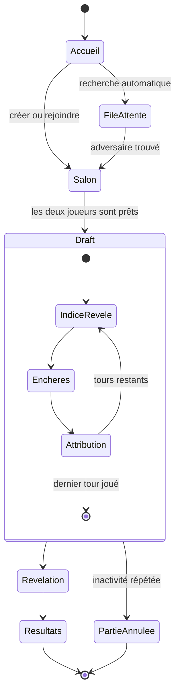
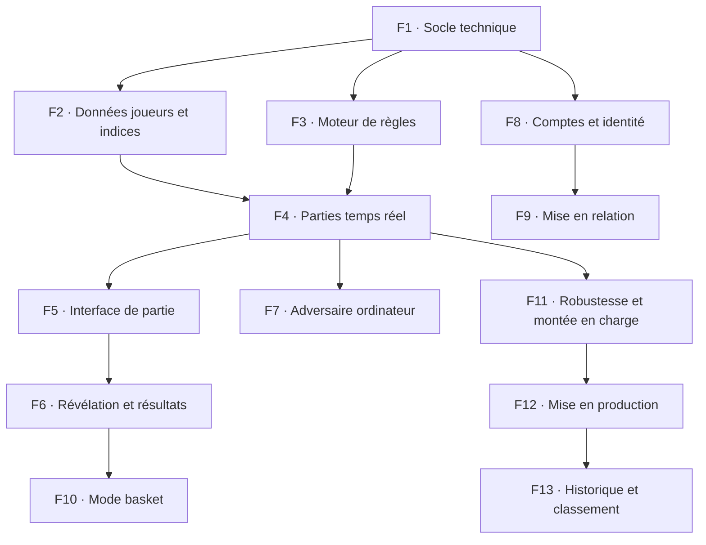

# Plan produit — Jeu de draft aux enchères 1v1

> Document de référence du projet. Toute décision structurante est consignée ici.

## 1. Vision

Un jeu en ligne compétitif à deux joueurs, en temps réel, où chacun constitue à l'aveugle la meilleure équipe possible en remportant des enchères sur des joueurs réels dont l'identité reste masquée jusqu'à la fin de la partie.

Le cœur du plaisir repose sur trois tensions : déduire qui se cache derrière un indice, évaluer combien ce joueur vaut réellement, et décider quand renoncer pour préserver un budget visible de tous.

## 2. Règles du jeu

### Cadre général

- Deux joueurs humains exactement, ou un joueur humain contre un adversaire piloté par l'ordinateur.
- Deux modes distincts, choisis avant la partie : **football** ou **basket**.
- Football : 11 tours, budget de départ de 44 € fictifs.
- Basket : 5 tours, budget de départ de 20 € fictifs.
- Le budget restant de chaque joueur est **public** en permanence.

### Déroulé d'un tour

1. Un lot est présenté simultanément aux deux joueurs. Il contient uniquement un **poste** et une **anecdote**, généralement liée au palmarès. L'identité du joueur réel est cachée.
2. Les deux joueurs voient exactement le même indice.
3. Un joueur ouvre l'enchère. L'ouverture est tirée au sort au premier tour, puis alterne à chaque tour suivant.
4. L'enchère est **ascendante, alternée et publique** : chacun voit le montant courant et qui l'a posé.
5. Le montant de surenchère est **libre**, à condition d'être strictement supérieur à l'offre courante et inférieur ou égal au budget restant de celui qui mise.
6. Un joueur peut **passer** à tout moment, y compris dès l'ouverture.
7. L'enchère s'arrête dès qu'un joueur ne surenchérit pas. Le dernier enchérisseur remporte le lot.
8. **Seul le gagnant paie.** Le perdant ne débourse rien.
9. Si les deux joueurs passent d'entrée, le lot n'est attribué à personne et disparaît de la partie.
10. Lorsqu'un joueur n'a plus assez de budget pour surenchérir, l'enchère se bloque naturellement : l'autre remporte le lot au montant courant.

### Contraintes d'effectif

- Le poste n'impose aucune obligation de composition : c'est la valeur des joueurs qui prime.
- Seule limite en football : un joueur ne peut pas posséder plus de **deux gardiens**. Au-delà, il ne peut plus enchérir sur un lot de gardien.
- Un emplacement resté vide, faute de budget ou par renoncement, rapporte zéro point.

### Temps et abandon

- Chaque joueur dispose de **20 secondes** pour réagir quand c'est à lui de miser.
- Dépassement du délai : considéré comme un « passe », l'adversaire remporte l'enchère.
- **Deux dépassements par le même joueur** entraînent l'annulation de la partie.
- Si les deux joueurs sont inactifs, la partie est annulée.
- L'annulation d'une partie n'entraîne jamais la déconnexion du compte.

### Fin de partie et score

À l'issue du dernier tour, les identités sont révélées simultanément pour les deux effectifs.

Le score de chaque joueur est la somme des notes de ses joueurs, à laquelle s'ajoute **un point par euro non dépensé**. Le total le plus élevé l'emporte.

La séquence de révélation est un moment de jeu à part entière : dévoilement joueur par joueur, avec l'indice d'origine, le prix payé et la note réelle, avant l'affichage du total.

## 3. Choix structurants validés

| Sujet | Décision |
|---|---|
| Langage | TypeScript côté client et côté serveur |
| Organisation | Dépôt unique avec un espace client, un espace serveur et un socle commun partagé |
| Communication | WebSocket temps réel |
| Base de données | MySQL, administrée en développement via phpMyAdmin sur l'environnement local existant |
| Autorité | Le serveur détient seul la vérité : budgets, identités cachées, résolution des enchères, minuteurs |
| Conception | Orientée objet, une partie étant un objet autonome, plusieurs parties tournant en parallèle |
| Accès | Mode invité avec simple pseudo, et connexion Google pour conserver son historique |
| Données joueurs | Notes de type jeu vidéo, importées une fois en base, sans appel externe pendant les parties |
| Périmètre sportif | Cinq grands championnats européens pour le football, NBA pour le basket |
| Interface | Desktop, en français uniquement |
| Hébergement | Serveur privé virtuel |
| Tests | Couverture systématique du moteur de règles |

## 4. Découpage en features

Chaque feature est autonome, testable et livrable indépendamment. L'ordre proposé est aussi l'ordre de construction.

---

### F1 · Socle technique

Mettre en place le dépôt unique, la séparation client / serveur / socle commun, la connexion à la base MySQL locale et l'outillage de tests.

**Contenu**

- Structure du dépôt en trois espaces, avec partage des types et des règles entre client et serveur.
- Connexion à la base MySQL de l'environnement local, administrable via phpMyAdmin.
- Mécanisme de migration de schéma et de chargement initial des données.
- Configuration par variables d'environnement, distincte entre développement et production.
- Outillage de qualité : formatage, analyse statique, exécution des tests.

**Critère de réussite** : le client et le serveur démarrent ensemble, communiquent, et le serveur lit et écrit en base.

---

### F2 · Données joueurs et indices

Constituer et importer le catalogue de joueurs réels et leurs indices.

**Contenu**

- Catalogue de joueurs comportant : sport, nom, poste, club, nationalité, note.
- Association à chaque joueur d'une ou plusieurs anecdotes servant d'indice, généralement liées au palmarès.
- Import unique d'un jeu de données de notes de type jeu vidéo, sans dépendance externe en cours de partie.
- Rédaction manuelle des anecdotes pour garantir la qualité et l'ambiguïté volontaire des indices.
- Classement des joueurs par paliers de valeur, afin de permettre un tirage équilibré plutôt qu'aléatoire.
- Périmètre initial : joueurs actifs des cinq grands championnats européens, et joueurs NBA en activité.

**Hypothèses à valider en cours de route** : un pool d'environ 150 à 200 joueurs par sport pour la première version, extensible ensuite ; possibilité d'ajouter des légendes retraitées dans un second temps, leurs palmarès offrant de meilleures anecdotes.

**Critère de réussite** : le catalogue est en base, chaque joueur possède au moins un indice exploitable, et un tirage de lots équilibré peut être produit.

---

### F3 · Moteur de règles

Implémenter la totalité des règles du jeu sous forme d'une logique pure, indépendante du réseau, de la base et de l'interface.

**Contenu**

- Déroulement complet d'une partie : succession des tours, alternance de l'ouverture, gestion des passes.
- Validation de chaque mise : montant strictement supérieur à l'offre courante, compatible avec le budget, posée par le bon joueur au bon moment.
- Attribution du lot au dernier enchérisseur, débit du seul gagnant, gestion du lot non attribué.
- Application de la limite de deux gardiens en football.
- Détection du blocage par budget insuffisant.
- Gestion des dépassements de délai, du compteur d'inactivité et des conditions d'annulation.
- Calcul du score final, incluant le bonus d'un point par euro restant et les emplacements vides à zéro.

**Critère de réussite** : une partie entière peut être simulée sans réseau ni interface, et l'ensemble des cas limites est couvert par des tests automatisés. Cette feature est développée **avant** toute interface.

---

### F4 · Parties temps réel

Transformer le moteur en service multijoueur temps réel.

**Contenu**

- Chaque partie est un objet autonome détenant son état, son minuteur et ses joueurs ; plusieurs parties coexistent sans interférence.
- Création d'un salon privé accessible par un code court à partager, et rejoint par l'adversaire.
- Diffusion des événements de partie : ouverture d'un tour, nouvelle mise, décompte du temps, attribution du lot, fin de partie, annulation.
- **Filtrage des informations par destinataire** : le serveur ne transmet jamais l'identité d'un joueur caché avant la phase de révélation. Seuls le poste, l'anecdote et une référence opaque circulent.
- Minuteur de 20 secondes géré exclusivement par le serveur, le client n'affichant qu'un décompte visuel.
- Rejet de toute action invalide ou hors tour, sans jamais faire confiance au client.

**Critère de réussite** : deux navigateurs distincts peuvent jouer une partie complète, et l'inspection du trafic réseau ne révèle aucune identité cachée.

---

### F5 · Interface de partie

Construire l'expérience visuelle de la draft, pensée pour le desktop.

**Contenu**

- Écran d'accueil : choix du sport, création ou jonction d'un salon.
- Salon d'attente affichant les deux joueurs et leur état de préparation.
- Écran de draft comportant : la carte du lot en cours avec son poste et son anecdote, l'historique des mises du tour, les budgets des deux joueurs, le décompte de temps, et les commandes de mise et de passe.
- Effectifs des deux joueurs visibles en permanence, avec emplacements masqués côté identités mais prix payés visibles.
- Indication claire de à qui c'est le tour, et retours visuels sur chaque événement marquant.
- Gestion des états d'erreur : mise refusée, adversaire déconnecté, partie annulée.

**Critère de réussite** : une partie complète se joue de bout en bout sans confusion sur l'état courant ni sur l'action attendue.

---

### F6 · Révélation et résultats

Concevoir le dénouement de la partie comme un temps fort.

**Contenu**

- Révélation progressive des joueurs des deux effectifs, dévoilant pour chacun l'indice d'origine, l'identité réelle, le prix payé et la note.
- Mise en évidence des bonnes affaires et des surpayés.
- Tableau de scores détaillé : total des notes, bonus d'argent restant, total général.
- Annonce du vainqueur.
- Possibilité de relancer une partie avec le même adversaire.

**Critère de réussite** : le joueur comprend immédiatement pourquoi il a gagné ou perdu.

---

### F7 · Adversaire contrôlé par l'ordinateur

Permettre de jouer et de tester seul, dès les premières phases du projet.

**Contenu**

- Un adversaire automatique qui estime la valeur d'un lot à partir de l'indice, décide d'un prix plafond, surenchérit ou passe, et respecte les mêmes règles et délais qu'un humain.
- Au moins deux niveaux de comportement, l'un prudent, l'autre agressif.
- Utilisable aussi bien pour l'entraînement des joueurs que pour les tests de développement.

**Critère de réussite** : une partie complète peut être jouée en solo, et l'adversaire prend des décisions crédibles.

---

### F8 · Comptes et identité

Offrir deux portes d'entrée au jeu.

**Contenu**

- Mode invité : simple pseudo, accès immédiat à une partie, aucune donnée conservée durablement.
- Connexion Google : profil persistant permettant de conserver l'historique des parties.
- Possibilité de rattacher une session invité à un compte Google ultérieurement.
- Session sécurisée, réutilisée aussi bien pour les échanges temps réel que pour les échanges classiques.

**Critère de réussite** : un visiteur peut jouer en moins de trente secondes, et un utilisateur connecté retrouve ses parties passées.

---

### F9 · Mise en relation

Proposer les deux modes de rencontre.

**Contenu**

- Salon privé par code, pour jouer avec une personne choisie.
- File d'attente automatique, appariant deux joueurs ayant sélectionné le même sport.
- Possibilité d'annuler la recherche.
- Aucun spectateur n'est admis.

**Critère de réussite** : deux joueurs inconnus lancés simultanément en recherche se retrouvent dans la même partie.

---

### F10 · Mode basket

Décliner l'intégralité du jeu sur le basket.

**Contenu**

- Cinq tours, budget de 20 €, absence de la contrainte de gardien.
- Catalogue et indices spécifiques à la NBA.
- Adaptation du vocabulaire, des postes et de l'habillage visuel.
- Sélection du sport au lancement de la partie, les deux modes restant strictement séparés.

**Critère de réussite** : le mode basket est jouable de bout en bout avec le même niveau de finition que le football.

---

### F11 · Robustesse et montée en charge

Préparer le service à tenir plusieurs parties simultanées et à survivre aux aléas.

**Contenu**

- Reconnexion d'un joueur en cours de partie sans perte d'état, une coupure réseau ne devant pas être confondue avec de l'inactivité.
- Nettoyage automatique des parties abandonnées ou terminées.
- Architecture prévue dès maintenant pour fonctionner sur plusieurs instances serveur, avec un état partagé, cette capacité n'étant réellement activée qu'en phase 2.
- Limitation du rythme des actions pour éviter les abus.
- Journalisation des mises, permettant d'auditer une partie contestée.
- Suivi de l'état de santé du service.

**Critère de réussite** : une coupure réseau brève est transparente pour le joueur, et le service reste stable avec plusieurs parties en parallèle.

---

### F12 · Mise en production

Déployer le jeu sur un serveur privé virtuel.

**Contenu**

- Base MySQL de production, distincte de l'environnement de développement, avec sauvegardes régulières.
- Service placé derrière un serveur frontal gérant le chiffrement et le maintien des connexions temps réel persistantes.
- Procédure de déploiement reproductible et procédure de retour arrière.
- Séparation stricte des secrets et des paramètres entre environnements.

**Critère de réussite** : le jeu est accessible publiquement, en connexion sécurisée, et une mise à jour peut être déployée sans intervention manuelle complexe.

---

### F13 · Historique et classement

Donner de la profondeur à la progression, une fois le jeu stabilisé.

**Contenu**

- Historique détaillé des parties pour les utilisateurs connectés, consultable tour par tour.
- Statistiques personnelles : victoires, note moyenne d'équipe, budget moyen restant, meilleures affaires réalisées.
- Classement par niveau évoluant au fil des victoires et défaites.
- Classement général des joueurs.

**Critère de réussite** : un joueur régulier dispose d'une raison de revenir au-delà de la partie elle-même.

## 5. Ordre de livraison recommandé

| Jalon | Contenu | Résultat |
|---|---|---|
| Jalon 1 | F1, F2, F3 | Les règles fonctionnent et sont prouvées par les tests, sans interface |
| Jalon 2 | F4, F5, F6 | Première partie football jouable à deux, de bout en bout |
| Jalon 3 | F7 | Jeu testable en solo, boucle de jeu validée |
| Jalon 4 | F8, F9 | Comptes, invités et mise en relation automatique |
| Jalon 5 | F10 | Second sport disponible |
| Jalon 6 | F11, F12 | Service robuste et mis en ligne |
| Jalon 7 | F13 | Progression et rétention |

## 6. Points de vigilance

- **Étanchéité des identités cachées** : c'est la condition d'existence du jeu. Aucune information permettant d'identifier un joueur caché ne doit circuler avant la révélation, sous quelque forme que ce soit.
- **Autorité serveur sur le temps** : le minuteur de 20 secondes et la détection d'inactivité doivent être décidés par le serveur seul.
- **Équilibrage économique** : avec 44 € pour 11 tours et un paiement à la charge du seul gagnant, il faudra vérifier par simulation qu'un joueur ne peut pas rafler les premiers lots majeurs puis subir des tours blancs sans espoir. Le bonus d'un point par euro restant est volontairement faible et devra être réévalué après les premières parties réelles.
- **Qualité des indices** : un indice trop précis tue le jeu, un indice trop vague le rend aléatoire. La rédaction manuelle et l'ajustement progressif sont essentiels.
- **Tirage des lots** : un tirage purement aléatoire peut produire une partie déséquilibrée. La répartition par paliers de valeur doit être testée tôt.
- **Droits sur les données** : vérifier les conditions d'utilisation de la source de notes retenue avant toute mise en ligne publique.
